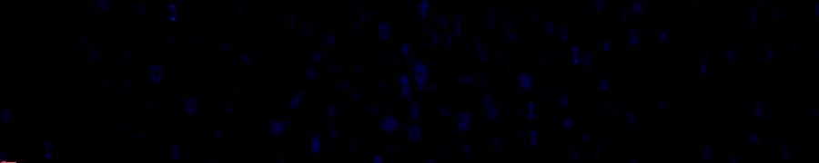

<h1 align="center" >Hi, I'm <a href="https://www.linkedin.com/in/deeksha-kulshreshtha-2b56a4223/" target="_blank"> DEEKSHA KULSHRESHTHA </a> </h1>

A Small Introduction of  Myself, I'm a curious person🙂. Eager to learn through <b>deep insights🔍 and implementations👩‍💻.
I used to read books📚</b>. Because it enhances visualization ability🧠 and concentration😌. 

Now, a days working to make myself standout💪 in my dream era.
<b>I also love to create quotes that describe my beliefs😇</b>.

<h3 align="center">state Level Achiever🥇| Machine Learner⚒️ | AI & DL enthusiast🧠 </h3>

<h3>
  
</h3>
   

<h1>Technical Skills 🛠</h1>
   
I have learned programming in a few languages. I have Worked on a few Projects related to Machine Learning and currently learning DSA.

 

 
 
 
    
    <!--  -->
    <!--  -->
    <!-- 
    
     -->
    <!--  -->
    <!--  -->
    

 <!-- <h1>Started Exploring </h1>

  
  
   
 

 -->

<h1 align="center">Projects</h1>

| Project Name      | Description | 
| :---:        |    :----   |  
| [DSA_Master](https://github.com/DeekshaKulshreshtha11/DSA_Master)     | Stuff to master in DSA 
| [Face Mask Detection](https://github.com/DeekshaKulshreshtha11/Face-Mask-Detection)   | Our model will detect whether a person is wearing a face mask or not.
<!-- | [Smart Mirror](https://github.com/The-Shivam-garg/Smart-mirror)     | In this Project we have automate the mirror using esp32 and add some cool features like google assistant . |
| [Community Website ](https://github.com/The-Shivam-garg/CollegeCommunity-Website)     | Techbenchers official website . We are a community of geeks. Come learn, share and connect with us.  -->

<h1 align="center">Let your uniqueness, be the key to your success💫</h1>

<a href="mailto:deekshakulshreshtha11@gmail.com">

<table>
  <tr>
   
<td>
    <td></td>
  </tr>
</table>

  

 
